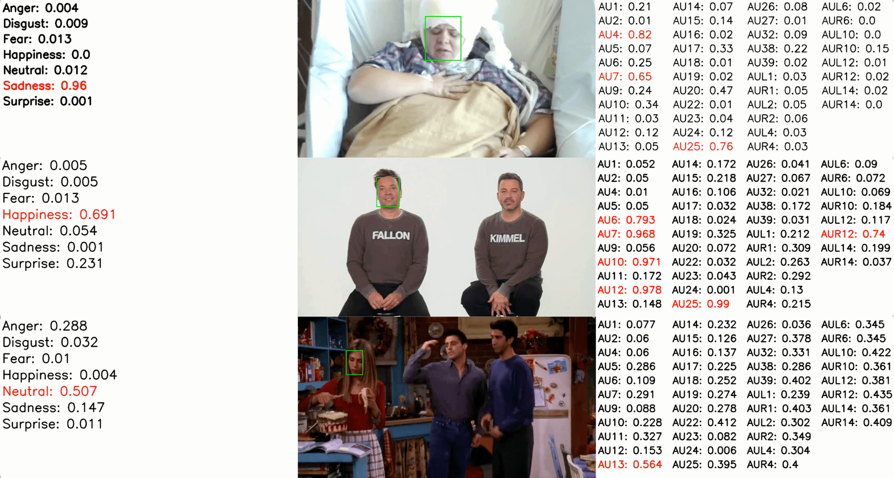

[![Contributors][contributors-shield]][contributors-url]
[![Forks][forks-shield]][forks-url]
[![Stargazers][stars-shield]][stars-url]
[![Issues][issues-shield]][issues-url]
[![Lab Website][lab-website-shield]][lab-website-url]
[![Twitter][twitter-shield]][twitter-url]
[![LinkedIn][linkedin-shield]][linkedin-url]

<!-- PROJECT LOGO -->
 

  

  <h1 align="center">FaceDx</h1>

  

    <h3>A Markerless Computer Vision Approach For Continuous Quantification of Internal States and Affective Behaviors in Clinical Settings</h3>
     
     
    <a href="https://github.com/JayRGopal/FaceEmotionDetection/issues/new?labels=bug&template=bug-report---.md">Report Bug</a>
    ·
    <a href="https://github.com/JayRGopal/FaceEmotionDetection/issues/new?labels=enhancement&template=feature-request---.md">Request Feature</a>
  

<!-- TABLE OF CONTENTS -->

  
Table of Contents

  <ol>
    <li>
      <a href="#project-overview">Project Overview</a>
      <ul>
        <li><a href="#built-with">Built With</a></li>
      </ul>
    </li>
    <li>
      <a href="#getting-started">Getting Started</a>
      <ul>
        <li><a href="#prerequisites">Prerequisites</a></li>
        <li><a href="#installation">Installation</a></li>
      </ul>
    </li>
    <li><a href="#usage">Usage</a></li>
    <li><a href="#roadmap">Roadmap</a></li>
    <li><a href="#contact">Contact</a></li>
    <li><a href="#acknowledgments">Acknowledgments</a></li>
  </ol>

<!-- PROJECT OVERVIEW -->
## Project Overview

TODO

(<a href="#readme-top">back to top</a>)

### Built With

TODO

(<a href="#readme-top">back to top</a>)

<!-- GETTING STARTED -->
## Getting Started

TODO

### Prerequisites

TODO

### Installation

TODO

(<a href="#readme-top">back to top</a>)

<!-- USAGE EXAMPLES -->
## Usage

TODO

(<a href="#readme-top">back to top</a>)

<!-- ROADMAP -->
## Roadmap

TODO

(<a href="#readme-top">back to top</a>)

<!-- CONTACTS -->
## Contacts

Yuhao "Danny" Huang, MD - [@YuhaoHuangMD](https://twitter.com/YuhaoHuangMD) - Yhhuang@Stanford.edu

Jay Gopal - [@JayRGopal](https://twitter.com/JayRGopal) - Jay_Gopal@Brown.edu & JGopal@Stanford.edu

Corey Keller, MD, PhD - [@DrCoreyKeller](https://twitter.com/DrCoreyKeller) - CKeller1@Stanford.edu

Project Link: [https://github.com/JayRGopal/FaceEmotionDetection](https://github.com/JayRGopal/FaceEmotionDetection)

(<a href="#readme-top">back to top</a>)

<!-- ACKNOWLEDGMENTS -->
## Acknowledgments

* [GitHub Emoji Cheat Sheet](https://www.webpagefx.com/tools/emoji-cheat-sheet)
* [Img Shields](https://shields.io)
* [Font Awesome](https://fontawesome.com)
* [README Template](https://github.com/othneildrew/Best-README-Template)
* [OpenGraphAU](https://github.com/lingjivoo/OpenGraphAU)
* [HSEmotion](https://github.com/av-savchenko/hsemotion)
* [DeepFace](https://github.com/serengil/deepface)

(<a href="#readme-top">back to top</a>)

<!-- MARKDOWN LINKS & IMAGES -->
<!-- https://www.markdownguide.org/basic-syntax/#reference-style-links -->
[contributors-shield]: https://img.shields.io/github/contributors/JayRGopal/FaceEmotionDetection
[contributors-url]: https://github.com/JayRGopal/FaceEmotionDetection/graphs/contributors
[forks-shield]: https://img.shields.io/github/forks/JayRGopal/FaceEmotionDetection
[forks-url]: https://github.com/JayRGopal/FaceEmotionDetection/network/members
[stars-shield]: https://img.shields.io/github/stars/JayRGopal/FaceEmotionDetection
[stars-url]: https://github.com/JayRGopal/FaceEmotionDetection/stargazers
[issues-shield]: https://img.shields.io/github/issues/JayRGopal/FaceEmotionDetection
[issues-url]: https://github.com/JayRGopal/FaceEmotionDetection/issues
[lab-website-shield]: https://img.shields.io/website?url=https%3A%2F%2Fprecisionneuro.stanford.edu%2F
[lab-website-url]: https://precisionneuro.stanford.edu/
[linkedin-shield]: https://img.shields.io/badge/LinkedIn-JayRGopal-blue
[linkedin-url]: https://linkedin.com/in/jay-gopal/
[twitter-shield]: https://img.shields.io/twitter/follow/JayRGopal
[twitter-url]: https://twitter.com/JayRGopal
